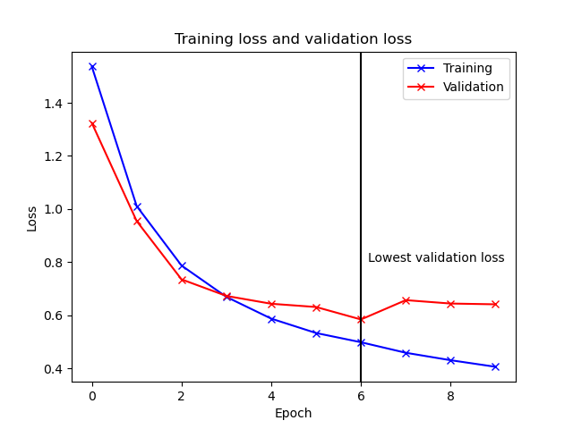
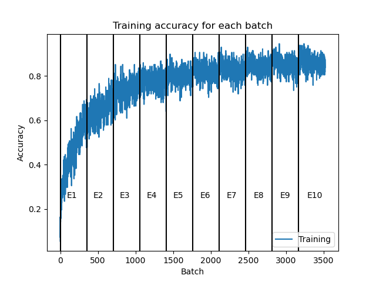
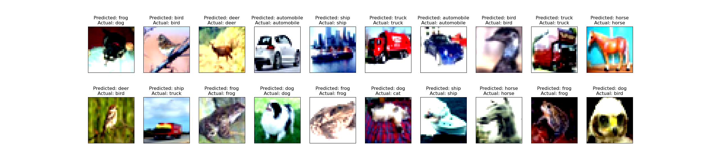

# PyTorch_Exploration
Developing a neural net with PyTorch to classify images from the CIFAR10 data set
Code is available in the pytorchpractice.py file the trained model can be accessed directly from nnmodel_cifar10.pt. 
The model is saved following the method: ```torch.save(model.state_dict(), PATH)```  
as described in the [PyTorch Documentation](https://pytorch.org/tutorials/beginner/saving_loading_models.html)  
To load the follow the instructions provided in the PyTorch documentation.  
The best accuracy achieved on the prediction set during a single batch was 0.85, 0.75 average best over an epoch  
Below are some general plots outlining model training, the code to produce these plots is in the main python script

[//]: <> 'cite a figure in HTML style'
<p align="center">
 
    <br>
    <em>Figure 1: Training and validation loss per epoch</em>
</p>
Comparison of the training and validation loss over epoch (each loss value is mean of loss for a given epoch) as we can see the training and validation loss begin to diverge after the 3rd epoch, indicating that the neural net begins overfitting the training data at that point. The model is only saved when the validation loss for an epoch decreases, so the saved model will record the model parameters at the end of epoch 6 when validation loss is at its minimum.
<p align="center">
 
    <br>
    <em>Figure 2: Training accuracy per batch</em>
</p>
Accuracy on the training set for each batch and each epoch. Epochs are noted by black vertical lines. As we can see training accuracy quickly approaches 0.8 then flattens out, suggesting that further epochs will not improve model accuracy (and will likely result in overfitting as shown in Figure 1). Given this plateau the only option to improve the model would be to change the structure of the neural net, making it deeper or more complex.
<p align="center">
 
    <br>
    <em>Figure 3: Model prediction on test set</em>
</p>
Figure 3 displays 20 randomly selected images from the test set which the model made predictions on. Both the predicted classes and actual classes for each model are displayed. The code to make this figure is at the bottom of the pytorchpractice.py script, it can be manually adjusted to change the number of images displayed (up to the number of images per batch) as well as to select different random images from the test set to plot.

Final note, the model was developed on a Mac with an M1 chip (Apple silicon). All tensors and the model itself are moved onto the GPU before and during the training phase using the MPS (metal performance sharders) backend in PyTorch. Specs of PyTorch version, Python version, and machine are listed at the top of the pytorchpractice.py file. Checks are in place to not move model or tensors over to mps if it is not available, however, if the script will not run (especially if you see an error similar to ```RuntimeError: All input tensors must be on the same device. ....```) it is likely that either the machine you are on does not have mps or either the model or tensors (but not both) were moved to the GPU. Again, there is a failsafe in place (if mps is not available leave everything on the CPU) but it is a good place to start trouble shooting errors. If model run on CPU the runtime might increase dramatically, model runtime on GPU was ~1.5 minutes for 10 epochs.
